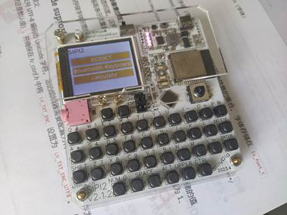
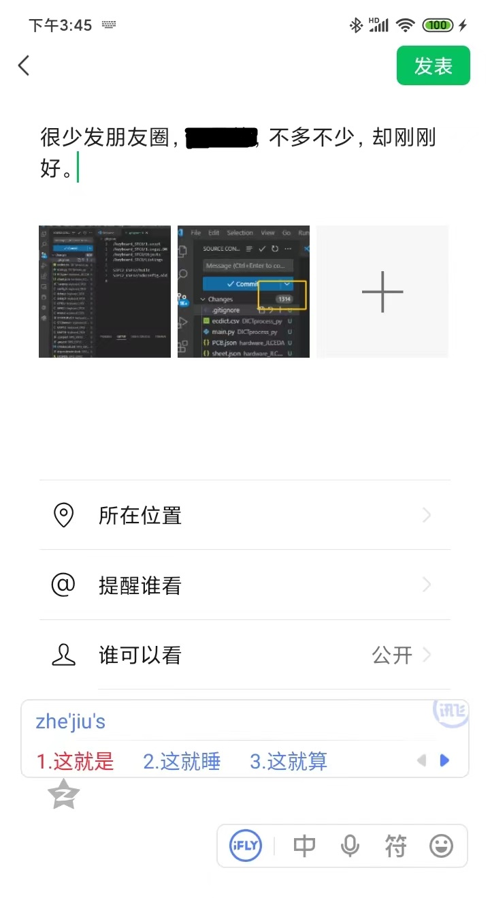

# SIPI2

一个基于ESP32(IDF)和LVGL实现的多功能单词机



<u>注：以上图片为旧版硬件SIPI2.0</u>

160x128 LCD  SPI屏幕，SPI/SDMMC内存卡存储单词内容，30余个按键全键输入，9x9.5迷你大小，硬件软件全部开源。

作者比较忙，**欢迎各位提交PR，有问题提issue**。git上的issue硬件软件问题都能问，硬件在这里提供json（JLCEDA PCB文件）和gerber。另在立创广场开源硬件项目。

若你只是想复刻这个项目，你可以到release获取所有gerber和二进制文件。

2.0问题已经全部修复，2.1版本还未验证，请知悉！！！

## 项目核心

本项目采用MIT开源，欢迎各位积极贡献代码！！！！

欢迎各位积极贡献代码！！！！

欢迎各位积极贡献代码！！！！

欢迎各位积极贡献代码！！！！

欢迎各位积极贡献代码！！！！

## 功能说明

1.查询单词

2.蓝牙键盘，可以连接手机电脑（进行中）

可开发功能

1.基于LVGL的俄罗斯方块等游戏

2.基于ESP ADF pwm或ADC的音乐播放器

3.基于LVGL的文件浏览器，电子相册

……


## 使用教程


以2.1硬件为例。

### 一.烧录

板子上有ESP32的复位按键，BOOT按键和STC8的复位按键。

需要分别给ESP32和STC单片机烧录程序。

若你只是想复刻这个项目，你可以到release获取所有gerber和二进制文件。

[Releases · SendToSouthEast/SIPI2 (github.com)](https://github.com/SendToSouthEast/SIPI2/releases)

#### 1.特制烧录器

本板子不集成串口转换芯片，但是你可以使用某些（自制）非规范的USB线，即DP DM分别是电脑TXD RXD的非规范的USB烧录器连接充电口进行烧录。只需将烧录插座的2.3行(ESP,USB)竖直连起来，就像这样 （A和B代表不同的短接帽）就可以对ESP32进行烧录。

```
OO
AB
AB
OO
```

同理，短接三四行就能对STC烧录。

```
OO
OO
AB
AB
```

#### 2.普通烧录器

这四个位置的定义如下

| GND     | GND     |
| ------- | ------- |
| ESP_TXD | ESP_RXD |
| USBDM   | USBDP   |
| STC_TXD | STC_RXD |

#### 3.注意事项

烧录教程不再写了，网上一查便是，说下注意事项


图为你烧录STC单片机的注意事项。

当你第一次烧录STC单片机时，复位脚是IO状态，你需要先点击烧录然后再给单片机供电。（具体请查）

当你关闭了复位脚用做IO口，在你**下一次烧录**时，不需要断电，先点击烧录再按下复位即可。

建议每次烧录都关闭复位脚用做IO口。注意，它默认是打开的，而且不会保存状态。

### 二.使用

打开电源后点击充电芯片的按键，开始供电。

键盘上面的左边的两个按键 是确定键，右边是返回键。

在Dict界面点击确定查词，点击返回进入蓝牙键盘模式。

在Word界面都会返回Dict界面。

目前五向按键尚未投入使用。

按下ALT后进入数字、符号输入模式

按下UPPER进入大写输入模式，再次按下即可取消。

目前因为对HID协议的通信不熟悉，导致符号输入有点问题，（HID有很多两个按键共用一个HID码）望大佬赐教。（如何同时按下shift和按键？）

蓝牙模式下可用手机连接，按照提示配置输入后就可以使用了。

讯飞输入法效果如图



## 硬件说明

**2.0问题已经全部修复，2.1.1版本还未验证，请知悉！！！**

充电部分电路参考[IP5306CK单片机电源板 - 嘉立创EDA开源硬件平台 (oshwhub.com)](https://oshwhub.com/yxynb/IP5306CKPOWERBOARD)

充电模块提供3.3V电源。

STC8单片机扫描键盘并通过串口2发送给ESP32。

### 重要物料BOM

并未有任何推广，你如果能在淘宝或者哪里买到更便宜的当然更好

| 元件                                  | 说明                                     | 示例链接                                                     |
| ------------------------------------- | ---------------------------------------- | ------------------------------------------------------------ |
| XB7608AJ                              | 锂电池保护芯片                           | https://item.szlcsc.com/2775921.html                         |
| IP5306CK                              | 充电芯片（持续升压）                     | [原装正品 IP5306_CK ESOP-8 2.1A充电2.4A放电 移动电源SOC芯片-淘宝网 (taobao.com)](https://item.taobao.com/item.htm?spm=a1z10.3-c-s.w4002-24706531953.12.68fe6a4bBAzjuy&id=663023987923) |
| STC8H1K28-LQFP32                      | 键盘扫描芯片                             | [STC8H1K28-36I-LQFP32 全新原装 STC8H1K28-淘宝网 (taobao.com)](https://item.taobao.com/item.htm?spm=a230r.1.14.36.57ea73fbUVK0uj&id=615435436806&ns=1&abbucket=16#detail) |
| ESP32-WROOM32                         | 主控                                     | 用兼容新产品也可                                             |
| 1.77寸TFT液晶显示屏14PIN焊接式ST7735S | 屏幕                                     | [1.77寸TFT液晶显示屏14PIN焊接SPI接口1.8寸显示屏14PIN串口SPI-淘宝网 (taobao.com)](https://item.taobao.com/item.htm?spm=a230r.1.14.13.41762419pn5ZGc&id=579752045837&ns=1&abbucket=16#detail) |
| 160G轻力度无声硅胶开关                | 建议买40个                               | [TS-E013 硅胶按钮6*6*5/4.3贴片无声A6按键硅胶车载汽车SW-PB轻触-淘宝网 (taobao.com)](https://item.taobao.com/item.htm?spm=a1z10.3-c-s.w4002-18164922779.14.3d3c6edb4XQNIZ&id=22248047162) |
| 五向开关                              | 目前没有用可以不装，买之前对照一下原理图 | [FT-007贴片10*10*5/7/9多功能多方向连接器五向开关 轻触复位按键-淘宝网 (taobao.com)](https://item.taobao.com/item.htm?spm=a1z0d.6639537/tb.1997196601.4.2b777484jefjoa&id=596429062451) |

### 外观尺寸

外观尺寸为90（w）x95（h），以左下角为坐标原点，五个螺丝孔的坐标分别为（单位mm）

| 5,5   | 5,90  |
| ----- | ----- |
| 85,5  | 15,90 |
| 25,49 |       |

## 项目结构

仓库共有四个主文件夹（项目）

| 文件夹          | 说明                                               | 语言/IDE/平台        |
| --------------- | -------------------------------------------------- | -------------------- |
| DICTprocess_py  | 将字典数据库处理为一个索引文件和一个数据文件的脚本 | python               |
| hardware_JLCEDA | 硬件文件                                           | 嘉立创EDA            |
| keyboard_STC8   | 键盘扫描程序，向主控串口发送数据                   | Keil STC8H1K         |
| SIPI2_ESP32     | 主控（ESP32）程序                                  | Vscode ESPIDF v4.4.2 |

其中字典处理的数据库来自[skywind3000/ECDICT](https://github.com/skywind3000/ECDICT)

keyboard_STC8的库文件为STC官方STC8库文件

```
│  .gitignore    // Git 版本控制忽略文件配置
│  LICENSE       // 代码许可证
│  README.md     // 项目说明文档
│
├─DICTprocess_py 	// Python 字典处理程序
│      ecdict.csv   // 英汉词典数据文件（来源见下）
│      main.py      // 主程序文件
│
├─hardware_JLCEDA 	// JLCEDA 硬件设计文件
│      PCB.json     // PCB 文件
│      sheet.json   // 原理图文件
│
├─keyboard_STC8    // STC8 键盘控制器程序
│  │  1.uvproj     // Keil uVision 项目文件
│  │  config.h     // 配置文件
│  │  delay.c      // 延时库稳健
│  │  delay.h      // 延时库头文件
│  │  GPIO.c       // GPIO 库文件
│  │  GPIO.h       // GPIO 库头文件
│  │  mian.c       // 主程序文件
│  │  STARTUP.A51  // Keil ASM 文件
│  │  STC8xxxx.H   // STC8 头文件
│  │  UART.C       // 串口库文件
│  │  UART.h       // 串口库头文件
│
├─README          // 项目说明文档
│      1.jpg      // 图片文件
│
└─SIPI2_ESP32     // ESP32 控制程序
				  //见下
				  
SIPI2_ESP32目录结构如下

│  .cproject
│  .project
│  CMakeLists.txt
│  dependencies.lock
│  partitions.csv			// 分区表文件
│  sdkconfig				// 记录ESP-IDF SDK配置选项的文件
│  sdkconfig.old
│
├─.vscode
│      c_cpp_properties.json
│      settings.json
│
├─components
│  ├─lvgl					// LittlevGL图形库组件
│  │
│  ├─lvgl_esp32_drivers     // LittlevGL在ESP32上的驱动组件
│  │
│  ├─lv_fs_if				// ESP和LVGL文件系统接口组件
│  │
│  └─sdcard_init			// SD卡初始化驱动程序组件(自编)
│          CMakeLists.txt
│          Kconfig			// 配置选项文件
│          sdcard_init.c	// SD卡初始化驱动程序的源代码文件
│          sdcard_init.h
│
└─main
	│  character.txt				// 存储字库字符的文本文件
	│  CMakeLists.txt
	│  config.h						// 配置选项头文件
	│  donotuse.txt
	│  init.c						// 初始化
	│  init.h
	│  Kconfig.projbuild
	│  main.c						// 主程序
	│  main.h
	│  simhei.c						// 简体中文黑体字体
	│
	├─scenes                        // 场景代码
	│  dictScene.c                  // 字典场景的源文件
	│  HIDScene.c                   // HID场景的源文件
	│  scenes.h                     // 场景代码的头文件
	│  wordScene.c                  // 单词场景的源文件
	│
	└─srcs							// 功能代码
    	├─blueHID					// 蓝牙HID功能代码
    	│      ble_hidd.c
 	   	│      ble_hidd.h
 	   	│      esp_hidd_prf_api.c
 	   	│      esp_hidd_prf_api.h
 	   	│      hidd_le_prf_int.h
  	  	│      hid_dev.c
  	  	│      hid_dev.h
	  	│      hid_device_le_prf.c
	    │
    	└─englishDict              // 英语词典代码
        englishDict.c              // 英语词典查词算法
        englishDict.h
```

其中，lvgl_esp32_drivers的st7735的屏幕驱动程序有修改，为兼容此屏幕。

sdcard_init是我写的component，引脚配置和模式选择在menuconfig中。之所以做成组件是因为lv_fs_if需要调用它来初始化文件系统。

本项目由去年写的代码第二次重构（第一次重构由arduino转到IDF，第二次模块化去耦），一些函数的实现没有动，若不规范欢迎大家指出改正！

## TODO

1.蓝牙键盘有点问题，目前因为对HID协议的通信不熟悉，导致符号输入有点问题，（HID有很多两个按键共用一个HID码）望大佬赐教。（如何同时按下shift和按键？

（SIPI2_ESP32\main\srcs\blueHID\ble_hidd.c）不能正确运行。


2.将五向开关利用起来

3.可能会做单词语音播放（还未开工）

4.你想做什么功能欢迎提交称为贡献者

## 开源许可

本项目采用MIT开源协议。同时也希望其它esp32项目多开源。

但是，请勿将我的项目搬运上传码云等平台。

## 鸣谢

[skywind3000/ECDICT: Free English to Chinese Dictionary Database (github.com)](https://github.com/skywind3000/ECDICT)

[lvgl/lvgl: Embedded graphics library to create beautiful UIs for any MCU, MPU and display type. It's boosted by a professional yet affordable drag and drop UI editor, called SquareLine Studio. (github.com)](https://github.com/lvgl/lvgl)

[lvgl/lvgl_esp32_drivers: Drivers for ESP32 to be used with LVGL (github.com)](https://github.com/lvgl/lvgl_esp32_drivers)

[lvgl/lv_fs_if: LVGL interfaces to various file systems (PC, FatFS) (github.com)](https://github.com/lvgl/lv_fs_if)

[espressif/esp-idf: Espressif IoT Development Framework. Official development framework for Espressif SoCs. (github.com)](https://github.com/espressif/esp-idf)

[FreeRTOS/FreeRTOS: 'Classic' FreeRTOS distribution. Started as Git clone of FreeRTOS SourceForge SVN repo. Submodules the kernel. (github.com)](https://github.com/FreeRTOS/FreeRTOS)

fatfs

感谢[ahzvenol (灵弦) (github.com)](https://github.com/ahzvenol) 的帮助

## 赞助作者

想喝一杯奶茶……可以吗

……家境贫寒……无电子词典可买……徒手搓之……


